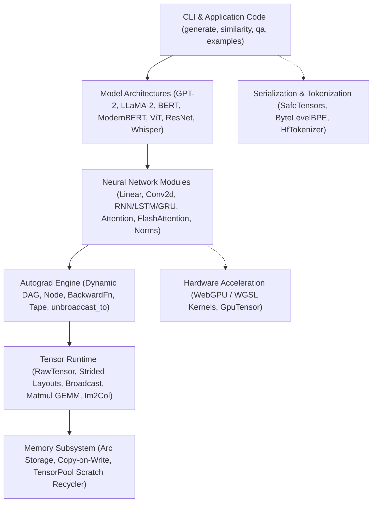

# Architecture & System Overview

Welcome to the comprehensive architecture and developer documentation for **Neural Network Engine**, a pure-Rust deep learning engine and tensor computation runtime built from scratch with zero C/BLAS runtime dependencies.

The engine provides strided multidimensional tensors, dynamic reverse-mode automatic differentiation (Autograd), modern neural network modules, optimizers, model architectures (Transformers, LLaMA, ModernBERT, Whisper, ViT, ResNets), INT8 quantization, and hardware GPU acceleration.

---

## High-Level Architecture

The framework is organized into decoupled layers, progressing from raw memory storage up to domain-specific foundation model pipelines and command-line interfaces:

---

## Directory & Documentation Guide

### 1. Core Runtime (`docs/core/`)
- [**Tensor Runtime**](file:///home/elvin/Development/Repositories/elvin-mark/neural-network-engine/docs/core/tensor.md): `RawTensor` architecture, strided layouts, multidirectional broadcasting, views, zero-copy slicing, and copy-on-write `Arc` buffers.
- [**Matrix Multiplication & Convolution**](file:///home/elvin/Development/Repositories/elvin-mark/neural-network-engine/docs/core/matmul-and-convolution.md): Cache-blocked parallel GEMM ($M_C \times K_C \times N_C$), Rayon work-stealing parallelism, SIMD vectorization, and lowered spatial 2D convolutions via `im2col`/`col2im`.
- [**Dynamic Autograd Engine**](file:///home/elvin/Development/Repositories/elvin-mark/neural-network-engine/docs/core/autograd.md): Dynamic reverse-mode computation DAG, `Tensor` wrapper, topological sorting, in-place gradient accumulation, `unbroadcast_to`, and numerical verification (`gradcheck`).
- [**Memory Pool**](file:///home/elvin/Development/Repositories/elvin-mark/neural-network-engine/docs/core/memory-pool.md): Zero-allocation thread-local `TensorPool` recycling scratch buffers across training iterations.

### 2. Neural Network Layers (`docs/nn/`)
- [**Modules & Layers**](file:///home/elvin/Development/Repositories/elvin-mark/neural-network-engine/docs/nn/modules.md): The `Module` trait, `Linear`, `Conv2d`, pooling (`MaxPool2d`), `Dropout`, `Embedding`, and `Sequential`.
- [**Activation Functions**](file:///home/elvin/Development/Repositories/elvin-mark/neural-network-engine/docs/nn/activations.md): Formulas, gradients, and numerical stability for ReLU, LeakyReLU, GELU, SiLU, Sigmoid, Tanh, and Softmax.
- [**Loss Functions**](file:///home/elvin/Development/Repositories/elvin-mark/neural-network-engine/docs/nn/losses.md): Numerically stable log-sum-exp implementations of `CrossEntropyLoss`, `MSELoss`, `BCEWithLogitsLoss`, and `L1Loss`.
- [**Normalization**](file:///home/elvin/Development/Repositories/elvin-mark/neural-network-engine/docs/nn/normalization.md): `LayerNorm`, `RMSNorm`, `BatchNorm1d`, and `BatchNorm2d`.
- [**Weight Initializations**](file:///home/elvin/Development/Repositories/elvin-mark/neural-network-engine/docs/nn/initialization.md): Xavier/Glorot, Kaiming/He, Orthogonal, Normal, and Uniform initializers.
- [**Recurrent Layers**](file:///home/elvin/Development/Repositories/elvin-mark/neural-network-engine/docs/nn/recurrent.md): Sequence modeling with Elman RNN, LSTM, and GRU (single/multi-layer, bidirectional).
- [**Attention & Transformers**](file:///home/elvin/Development/Repositories/elvin-mark/neural-network-engine/docs/nn/attention-and-transformers.md): Multi-Head Attention, Grouped-Query Attention (GQA), Rotary Position Embeddings (RoPE), FlashAttention-2 online softmax, and $O(1)$ KV-Cache.
- [**MoE & Quantization**](file:///home/elvin/Development/Repositories/elvin-mark/neural-network-engine/docs/nn/moe-and-quantization.md): Sparse Mixture-of-Experts (`TopKRouter`, `MoELayer`) and INT8 quantization (`Int8Tensor`, `QLinear`).

### 3. Training & Optimization (`docs/training/`)
- [**Optimizers**](file:///home/elvin/Development/Repositories/elvin-mark/neural-network-engine/docs/training/optimizers.md): `SGD` (momentum & Nesterov), `Adam`, `AdamW` (decoupled weight decay), and `RMSprop`.
- [**Schedulers & Clipping**](file:///home/elvin/Development/Repositories/elvin-mark/neural-network-engine/docs/training/schedulers-and-clipping.md): Learning rate schedules (`CosineAnnealingLR`, `StepLR`, `LinearWarmupCosineLR`) and gradient clipping (`clip_grad_norm`, `clip_grad_value`).
- [**Mixed Precision**](file:///home/elvin/Development/Repositories/elvin-mark/neural-network-engine/docs/training/mixed-precision.md): Automatic mixed precision simulation and dynamic loss scaling (`LossScaler`).

### 4. Reference Architectures (`docs/models/`)
- [**Model Catalog Overview**](file:///home/elvin/Development/Repositories/elvin-mark/neural-network-engine/docs/models/README.md): Pretrained configurations and SafeTensors loader specifications.
- [**LLaMA-2**](file:///home/elvin/Development/Repositories/elvin-mark/neural-network-engine/docs/models/llama.md): GQA, RoPE, and SwiGLU autoregressive transformer.
- [**GPT-2**](file:///home/elvin/Development/Repositories/elvin-mark/neural-network-engine/docs/models/gpt2.md): Causal decoder language model with Conv1D transposed weight mapping.
- [**BERT**](file:///home/elvin/Development/Repositories/elvin-mark/neural-network-engine/docs/models/bert.md): Bidirectional encoder for Question Answering and sentence embeddings (`all-MiniLM-L6-v2`, `dynamic_tinybert`).
- [**ModernBERT**](file:///home/elvin/Development/Repositories/elvin-mark/neural-network-engine/docs/models/modern-bert.md): Alternating local sliding window and global attention, unpadded sequence representations, and GeGLU activations.
- [**Vision Transformer (ViT)**](file:///home/elvin/Development/Repositories/elvin-mark/neural-network-engine/docs/models/vit.md): Patch projection embeddings, classification token (`[CLS]`), and vision transformer blocks.
- [**ResNet**](file:///home/elvin/Development/Repositories/elvin-mark/neural-network-engine/docs/models/resnet.md): Residual convolutional architectures (ResNet-18, ResNet-34, ResNet-50) with Basic and Bottleneck skip connections.
- [**Whisper**](file:///home/elvin/Development/Repositories/elvin-mark/neural-network-engine/docs/models/whisper.md): Audio speech recognition encoder-decoder with log-mel spectrogram acoustic frontend.

### 5. Infrastructure & Tooling (`docs/infra/`)
- [**Hardware GPU Acceleration**](file:///home/elvin/Development/Repositories/elvin-mark/neural-network-engine/docs/infra/gpu.md): WebGPU / WGSL compute kernels, `GpuTensor`, and buffer reuse.
- [**Serialization**](file:///home/elvin/Development/Repositories/elvin-mark/neural-network-engine/docs/infra/serialization.md): Zero-copy SafeTensors loading and checkpointing.
- [**Tokenizers**](file:///home/elvin/Development/Repositories/elvin-mark/neural-network-engine/docs/infra/tokenizers.md): Pure-Rust `ByteLevelBPE` and HuggingFace `tokenizer.json` parser (`HfTokenizer`).
- [**Dataset Utilities & Vision Transforms**](file:///home/elvin/Development/Repositories/elvin-mark/neural-network-engine/docs/infra/data-and-vision.md): `DataLoader`, dataset readers (MNIST, CIFAR-10/100, Iris), and augmentations.
- [**Audio Processing**](file:///home/elvin/Development/Repositories/elvin-mark/neural-network-engine/docs/infra/audio.md): STFT, Mel filterbanks, and log-mel spectrogram computation.
- [**Python Bindings**](file:///home/elvin/Development/Repositories/elvin-mark/neural-network-engine/docs/infra/python.md): PyO3 extension module and NumPy ndarray conversion.
- [**Command-Line Interfaces**](file:///home/elvin/Development/Repositories/elvin-mark/neural-network-engine/docs/infra/cli.md): Standalone binaries for generation (`generate`), sentence similarity (`similarity`), and extractive QA with dense passage retrieval (`qa`).
