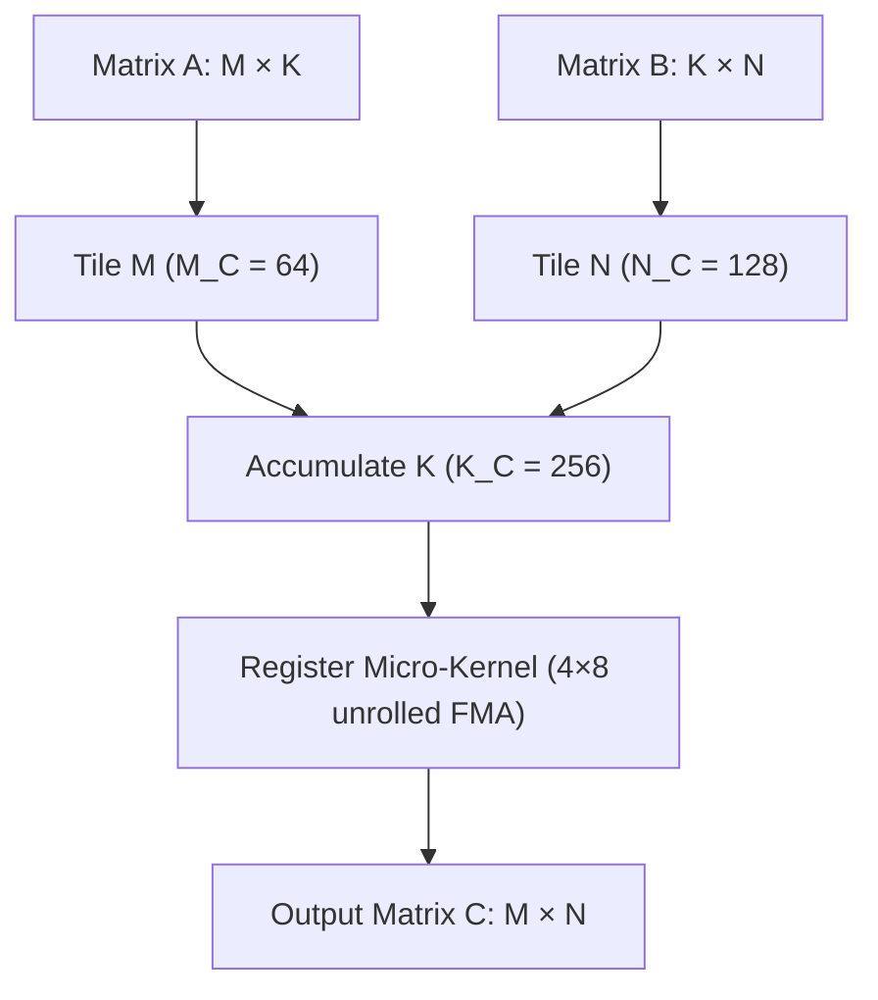
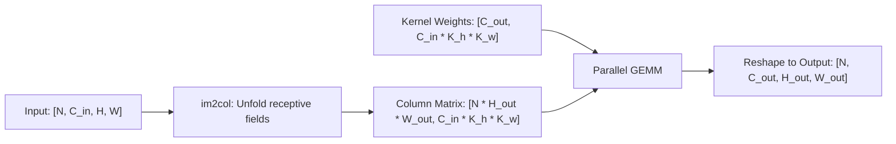

# Matrix Multiplication & Spatial Convolutions

High-performance linear algebra and spatial convolutions in pure Rust without external BLAS or C runtime dependencies.

**Source files**:
- GEMM Implementation: [`src/tensor/matmul.rs`](file:///home/elvin/Development/Repositories/elvin-mark/neural-network-engine/src/tensor/matmul.rs)
- Convolution & Pooling: [`src/tensor/conv.rs`](file:///home/elvin/Development/Repositories/elvin-mark/neural-network-engine/src/tensor/conv.rs)
- Microbenchmarks: [`benches/gemm_bench.rs`](file:///home/elvin/Development/Repositories/elvin-mark/neural-network-engine/benches/gemm_bench.rs)

---

## High-Performance Parallel GEMM

Matrix multiplication ($C = A \times B$) is implemented with cache blocking, loop unrolling, and Rayon multithreading.

### Cache-Blocking Hierarchy
To fit within modern CPU cache hierarchies (L1, L2, L3), matrix dimensions $M \times K \times N$ are tiled into blocks:

- **$M_C = 64$**: Outer row tile fits in L2/L3 cache.
- **$K_C = 256$**: Inner accumulation tile keeps operational working sets within L1 data cache.
- **$N_C = 128$**: Column tile for vectorized stores.
- **Micro-kernel ($4 \times 8$ or $8 \times 8$)**: Kept within CPU registers to maximize FMA (Fused Multiply-Add) throughput.



### Multithreading with Rayon
For matrices where $M \times N \ge 1024$, parallel chunks of row tiles ($M_C$) are distributed across Rayon threads:

```rust
pub fn matmul(&self, other: &RawTensor) -> Result<RawTensor>
```

### Batched Matrix Multiplication
Tensors with higher rank (e.g. $[B, H, S, D]$ in multi-head attention) automatically execute 2D GEMM over leading batch/head dimensions:
```rust
// A: [Batch, M, K], B: [Batch, K, N] -> C: [Batch, M, N]
```
Broadcasting across batch dimensions (e.g. $[1, H, S, S] \times [B, H, S, D]$) is natively supported.

---

## 2D Convolution via `im2col` & `col2im`

Spatial 2D convolutions (`Conv2d`) are lowered to GEMM using the classical `im2col` transformation:



### Convolution Parameters (`Conv2dParams`)
```rust
pub struct Conv2dParams {
    pub in_channels: usize,
    pub out_channels: usize,
    pub kernel_size: (usize, usize),
    pub stride: (usize, usize),
    pub padding: (usize, usize),
    pub dilation: (usize, usize),
    pub groups: usize,
}
```

The output dimensions are calculated as:
$$H_{\text{out}} = \left\lfloor \frac{H_{\text{in}} + 2 \times \text{padding}_h - \text{dilation}_h \times (\text{kernel}_h - 1) - 1}{\text{stride}_h} \right\rfloor + 1$$
$$W_{\text{out}} = \left\lfloor \frac{W_{\text{in}} + 2 \times \text{padding}_w - \text{dilation}_w \times (\text{kernel}_w - 1) - 1}{\text{stride}_w} \right\rfloor + 1$$

### Backward Pass (`col2im`)
During backpropagation, gradients w.r.t input activations are accumulated back from the column gradient matrix to the original spatial dimensions via `col2im`, correctly summing overlapping receptive fields when $\text{stride} < \text{kernel}_{\text{size}}$.

---

## Spatial Pooling (`MaxPool2d`)

Max pooling operates directly on sliding spatial windows:
- **Forward Pass**: Finds and records the maximum value in each receptive window along with argmax indices.
- **Backward Pass**: Routes incoming gradients exclusively to the recorded argmax spatial locations, setting all other locations to zero.

---

## See Also
- [Tensor Runtime (`RawTensor`)](file:///home/elvin/Development/Repositories/elvin-mark/neural-network-engine/docs/core/tensor.md)
- [Automatic Differentiation Engine](file:///home/elvin/Development/Repositories/elvin-mark/neural-network-engine/docs/core/autograd.md)
- [Neural Network Modules (`Conv2d`, `MaxPool2d`)](file:///home/elvin/Development/Repositories/elvin-mark/neural-network-engine/docs/nn/modules.md)
