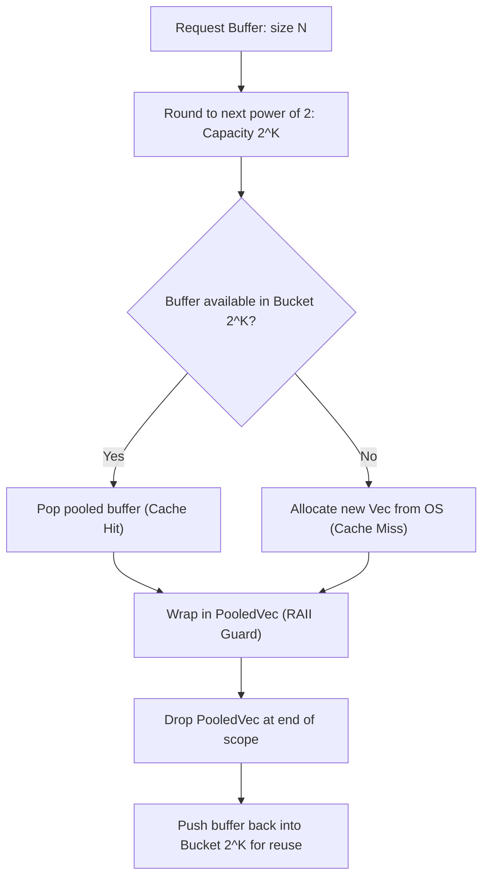

# Memory Pool (`TensorPool`)

The `TensorPool` is a thread-local memory recycler that eliminates allocation and deallocation overhead during iterative forward and backward passes.

**Source files**:
- Core implementation: [`src/tensor/pool.rs`](file:///home/elvin/Development/Repositories/elvin-mark/neural-network-engine/src/tensor/pool.rs)
- Memory Storage: [`src/tensor/storage.rs`](file:///home/elvin/Development/Repositories/elvin-mark/neural-network-engine/src/tensor/storage.rs)
- Integration Tests: [`tests/pool_tests.rs`](file:///home/elvin/Development/Repositories/elvin-mark/neural-network-engine/tests/pool_tests.rs)

---

## The Allocation Bottleneck in Deep Learning

In standard deep learning loops, intermediate activations, attention matrices, and temporary scratch buffers are constantly allocated on the heap via `malloc`/`free` and immediately discarded when scope ends. Under multi-threaded training workloads, heap contention degrades throughput.

`TensorPool` mitigates this by maintaining power-of-two capacity buckets inside a thread-local cache:



---

## RAII Buffer Recycling (`PooledVec`)

Buffers checked out from the pool are wrapped in `PooledVec`:
```rust
pub struct PooledVec {
    buffer: Option<Vec<f32>>,
    pool: Option<Arc<Mutex<TensorPool>>>,
}
```

When a `PooledVec` is dropped, its `Drop` implementation intercepts the deallocation and returns the underlying `Vec<f32>` back into the matching bucket of `TensorPool`, preserving capacity without releasing memory back to the operating system allocator.

---

## Pool Statistics (`PoolStats`)

The engine provides runtime introspection to measure cache hit rates and memory savings:

```rust
pub struct PoolStats {
    pub total_allocations: usize,
    pub pool_hits: usize,
    pub pool_misses: usize,
    pub current_cached_buffers: usize,
    pub current_cached_bytes: usize,
}
```

### Accessing Statistics
```rust
let stats = TensorPool::global().stats();
println!(
    "Pool Hit Rate: {:.2}% ({}/{} requests served without heap allocation)",
    (stats.pool_hits as f32 / stats.total_allocations as f32) * 100.0,
    stats.pool_hits,
    stats.total_allocations
);
```

---

## See Also
- [Tensor Runtime (`RawTensor`)](file:///home/elvin/Development/Repositories/elvin-mark/neural-network-engine/docs/core/tensor.md)
- [Hardware GPU Buffer Pool](file:///home/elvin/Development/Repositories/elvin-mark/neural-network-engine/docs/infra/gpu.md)
