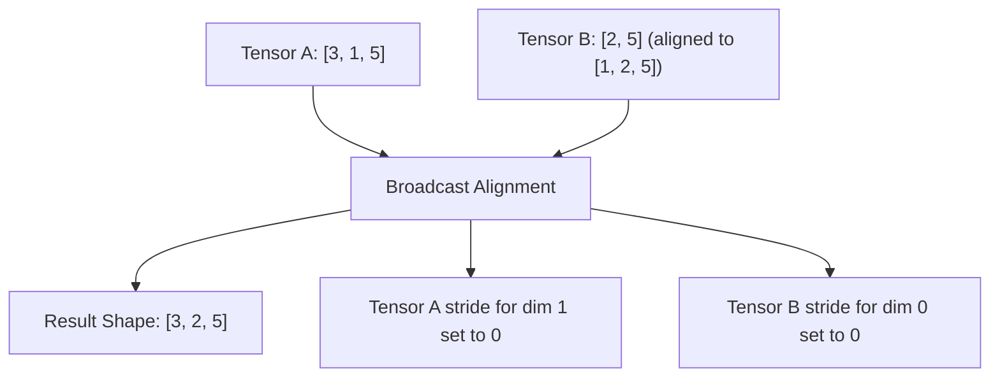

# Tensor Runtime (`RawTensor`)

The `RawTensor` type represents an $N$-dimensional multidimensional array supporting non-contiguous strided memory layouts, zero-copy transformations, multidirectional broadcasting, and copy-on-write buffer sharing.

**Source files**:
- Core implementation: [`src/tensor/mod.rs`](file:///home/elvin/Development/Repositories/elvin-mark/neural-network-engine/src/tensor/mod.rs)
- Memory Storage: [`src/tensor/storage.rs`](file:///home/elvin/Development/Repositories/elvin-mark/neural-network-engine/src/tensor/storage.rs)
- Shape & Strides: [`src/tensor/shape.rs`](file:///home/elvin/Development/Repositories/elvin-mark/neural-network-engine/src/tensor/shape.rs)
- Elementwise Ops: [`src/tensor/ops.rs`](file:///home/elvin/Development/Repositories/elvin-mark/neural-network-engine/src/tensor/ops.rs)
- Reductions: [`src/tensor/reduce.rs`](file:///home/elvin/Development/Repositories/elvin-mark/neural-network-engine/src/tensor/reduce.rs)
- Error Types: [`src/error.rs`](file:///home/elvin/Development/Repositories/elvin-mark/neural-network-engine/src/error.rs)

---

## Memory Representation & Layout

A `RawTensor` is defined as:
```rust
pub struct RawTensor {
    data: Storage,
    shape: Vec<usize>,
    strides: Vec<usize>,
    offset: usize,
}
```

### Storage: Copy-on-Write Memory
Data is stored within `Storage`, which wraps either an `Arc<Vec<f32>>` (standard shared buffer) or a `PooledVec` (allocated from `TensorPool`). When mutating a tensor in-place or obtaining a mutable slice, `Storage::make_mut()` clones the underlying vector only if the reference count is greater than 1 (Copy-on-Write / CoW semantics).

### Strides and Indexing
For an $N$-dimensional index $(i_0, i_1, \dots, i_{N-1})$, the flat buffer offset is computed as:
$$\text{flat}_{\text{index}} = \text{offset} + \sum_{d=0}^{N-1} i_d \times \text{strides}[d]$$

A tensor is **contiguous** (row-major / C-contiguous) if:
$$\text{strides}[d] = \prod_{k=d+1}^{N-1} \text{shape}[k]$$
with $\text{strides}[N-1] = 1$.

```rust
// Fast check for standard C-contiguity
pub fn is_contiguous(&self) -> bool
```

If non-contiguous, `tensor.to_contiguous()` produces a freshly allocated contiguous copy.

---

## Views and Zero-Copy Transformations

Many tensor operations manipulate only `shape`, `strides`, and `offset` without copying or reallocating memory:

| Operation | Method Signature | Description | Complexity |
|---|---|---|---|
| **Reshape** | `reshape(&self, shape: &[usize]) -> Result<RawTensor>` | Adjusts dimensions. Requires contiguity or returns error if non-contiguous view cannot be reshaped without copy. | $O(1)$ |
| **Transpose** | `transpose(&self, dim0: usize, dim1: usize) -> Result<RawTensor>` | Swaps dimensions and corresponding strides. | $O(1)$ |
| **Permute** | `permute(&self, dims: &[usize]) -> Result<RawTensor>` | Permutes arbitrary dimensions and strides. | $O(1)$ |
| **Slicing** | `slice(&self, dim: usize, start: usize, end: usize) -> Result<RawTensor>` | Adjusts `shape[dim]` and updates `offset += start * strides[dim]`. | $O(1)$ |
| **Squeeze / Unsqueeze** | `squeeze(&self, dim: Option<usize>)`, `unsqueeze(&self, dim: usize)` | Removes or inserts dimension of size 1. | $O(1)$ |

---

## Multidirectional Broadcasting

The engine implements full NumPy/PyTorch-compliant multidirectional broadcasting rules. Two shapes are broadcast-compatible if, starting from trailing dimensions:
1. The dimensions are equal, or
2. One of the dimensions is 1.



When broadcasting, dimensions expanded from 1 are given a stride of `0`, allowing elementwise operations to access elements without memory duplication:
```rust
pub fn broadcast_to(&self, target_shape: &[usize]) -> Result<RawTensor>
```

---

## Elementwise Operations

Arithmetic operations support automatic broadcasting across tensors or scalar values:

- **Binary Operations**: `add`, `sub`, `mul`, `div`, `pow` (operator overloads `+`, `-`, `*`, `/`).
- **Unary Operations**: `neg`, `abs`, `exp`, `log`, `sqrt`, `sin`, `cos`, `tanh`, `clamp`.
- **Parallel Execution**: Contiguous tensors larger than 4,096 elements automatically dispatch elementwise computations across Rayon work-stealing thread pools using SIMD-friendly vector operations.

---

## Reductions

Reductions collapse one or all axes with optional dimension preservation (`keepdim`):

```rust
pub fn sum(&self, dim: usize, keepdim: bool) -> Result<RawTensor>
pub fn mean(&self, dim: usize, keepdim: bool) -> Result<RawTensor>
pub fn max(&self, dim: usize, keepdim: bool) -> Result<RawTensor>
pub fn min(&self, dim: usize, keepdim: bool) -> Result<RawTensor>
pub fn var(&self, dim: usize, keepdim: bool) -> Result<RawTensor>
pub fn std(&self, dim: usize, keepdim: bool) -> Result<RawTensor>
pub fn sum_all(&self) -> f32
```

Numerically sensitive reductions (such as variance and standard deviation) use two-pass mean-deviation accumulation to prevent catastrophic floating-point cancellation.

---

## See Also
- [Matrix Multiplication & Convolution](file:///home/elvin/Development/Repositories/elvin-mark/neural-network-engine/docs/core/matmul-and-convolution.md)
- [Automatic Differentiation (`autograd`)](file:///home/elvin/Development/Repositories/elvin-mark/neural-network-engine/docs/core/autograd.md)
- [Memory Pool (`TensorPool`)](file:///home/elvin/Development/Repositories/elvin-mark/neural-network-engine/docs/core/memory-pool.md)
