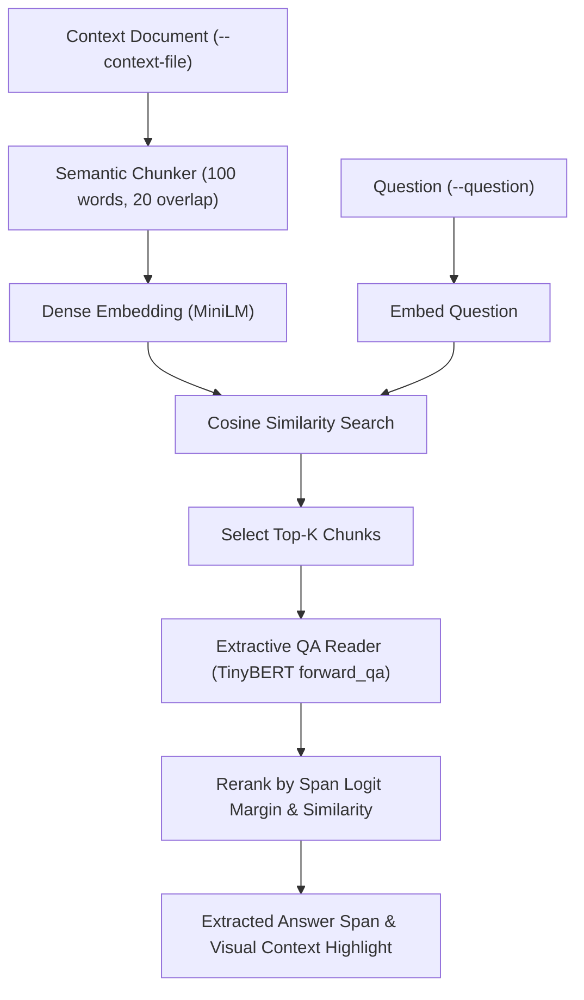
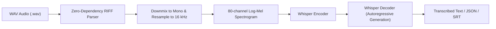
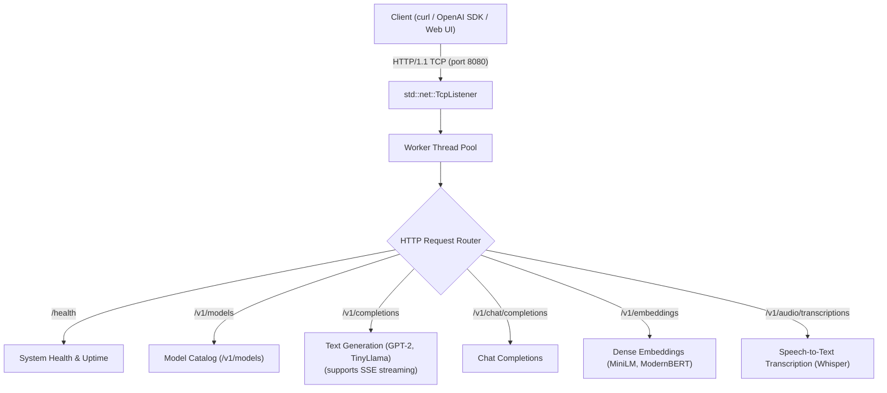

# Command-Line Interfaces (`src/bin`)

Production-ready standalone CLI binaries for autoregressive text generation, dense sentence similarity search, and extractive Question Answering with retrieval-augmented generation (RAG).

**Source files**:
- Text Generation CLI: [`src/bin/generate.rs`](file:///home/elvin/Development/Repositories/elvin-mark/neural-network-engine/src/bin/generate.rs)
- Sentence Similarity CLI: [`src/bin/similarity.rs`](file:///home/elvin/Development/Repositories/elvin-mark/neural-network-engine/src/bin/similarity.rs)
- Question Answering CLI: [`src/bin/qa.rs`](file:///home/elvin/Development/Repositories/elvin-mark/neural-network-engine/src/bin/qa.rs)

---

## 1. Text Generation (`generate`)

Autoregressive streaming token generation using GPT-2 or LLaMA-2 checkpoints with KV-Cache acceleration and flexible stochastic sampling.

```bash
cargo run --release --bin generate -- \
    --prompt "In a distant galaxy, an autonomous probe discovered" \
    --max-tokens 100 \
    --temperature 0.8 \
    --top-p 0.9 \
    --model-dir checkpoints/gpt2
```

### CLI Arguments
| Flag | Description | Default |
|---|---|---|
| `-p, --prompt <TEXT>` | Initial text prompt to prime the language model | `""` (launches interactive REPL) |
| `-n, --max-tokens <N>` | Maximum new tokens to generate | `64` |
| `-t, --temperature <F>` | Softmax temperature ($T \to 0$ for greedy, $T > 1$ for creative) | `1.0` |
| `-k, --top-k <N>` | Top-K vocabulary truncation (0 disables) | `50` |
| `--top-p <F>` | Nucleus sampling cumulative probability threshold | `0.9` |
| `--repetition-penalty <F>` | Multiplicative penalty applied to previously generated tokens | `1.1` |
| `-m, --model-dir <DIR>` | Directory containing `model.safetensors` and `tokenizer.json` | `"checkpoints/gpt2"` |

---

## 2. Sentence Similarity (`similarity`)

Embeds query and candidate sentences into normalized dense vector representations via BERT / ModernBERT and ranks candidates by cosine similarity.

```bash
cargo run --release --bin similarity -- \
    --query "Deep learning in Rust" \
    -C "High performance machine learning inference in pure Rust" \
    -C "Neural network autograd computation engine" \
    -C "The history of the Roman empire" \
    -C "Baking artisanal French sourdough bread"
```

### CLI Arguments
| Flag | Description | Default |
|---|---|---|
| `-q, --query <TEXT>` | Query sentence to compare against | Interactive prompt if omitted |
| `-c, --candidate <TEXT>` | Candidate sentence (can be repeated multiple times) | `[]` |
| `-m, --model-dir <DIR>` | Directory containing checkpoint files | `"checkpoints/minilm"` |
| `--arch <NAME>` | Model architecture family (`bert` or `modern-bert`) | `"bert"` |

---

## 3. Question Answering with Dense Retrieval (`qa`)

Extractive SQuAD-style question answering powered by `BertForQuestionAnswering` (`dynamic_tinybert`) combined with dense passage retrieval (RAG) using `all-MiniLM-L6-v2`.



### Standalone File QA with RAG
```bash
cargo run --release --bin qa -- \
    --context-file README.md \
    --question "What license is the engine released under?" \
    --rag
```

### Interactive Console Mode
```bash
cargo run --release --bin qa -- --rag
```

### CLI Arguments
| Flag | Description | Default |
|---|---|---|
| `-c, --context <TEXT>` | Single text context passage | None |
| `-f, --context-file <FILE>` | Text file containing context | None |
| `-q, --question <TEXT>` | Question to answer | Interactive prompt if omitted |
| `--rag` | Enables semantic chunking & dense passage retrieval | `false` |
| `--chunk-size <N>` | Maximum words per semantic chunk | `100` |
| `--chunk-overlap <N>` | Overlapping words between adjacent chunks | `20` |
| `--top-chunks <N>` | Number of top retrieved chunks evaluated by QA reader | `3` |
| `-m, --model-dir <DIR>` | Extractive QA checkpoint directory | `"checkpoints/tinybert"` |
| `--embedding-dir <DIR>` | Dense retriever checkpoint directory | `"checkpoints/minilm"` |

---

## 4. Speech-to-Text Transcription (`transcribe`)

Autoregressive speech recognition transcription CLI powered by OpenAI Whisper (`openai/whisper-tiny`). Parses standard `.wav` files without external libraries, downmixes multi-channel stereo to mono, resamples to 16 kHz, computes 80-channel log-mel spectrograms, and decodes audio into text.



### Transcribe a WAV file
```bash
cargo run --release --bin transcribe -- audio.wav
```

### Transcribe with JSON Output & Repetition Penalty
```bash
cargo run --release --bin transcribe -- audio.wav \
    --format json \
    --temperature 0.0 \
    --repetition-penalty 1.1
```

### CLI Arguments
| Flag | Description | Default |
|---|---|---|
| `<AUDIO_FILE>` | Input `.wav` audio file (positional) | None |
| `-a, --audio <PATH>` | Explicit flag to specify audio file path | None |
| `-m, --model-dir <DIR>` | Directory containing Whisper weights and tokenizer | `"checkpoints/whisper"` |
| `-l, --language <LANG>` | Target language code (`en`, `fr`, `de`, `es`, `zh`, etc.) | `"en"` |
| `--task <TASK>` | Task mode (`transcribe` or `translate`) | `"transcribe"` |
| `-n, --max-tokens <N>` | Maximum target text tokens to generate | `448` |
| `-t, --temperature <F>` | Softmax temperature (`0.0` for deterministic greedy) | `0.0` |
| `--top-p <F>` | Nucleus sampling probability threshold | `0.9` |
| `--repetition-penalty <F>` | Multiplicative penalty for previously generated tokens | `1.1` |
| `-f, --format <FMT>` | Output format (`txt`, `json`, `srt`) | `"txt"` |
| `--timestamps` | Include segment timestamps in output | `false` |
| `-s, --seed <N>` | Random seed for sampling | None |

---

## 5. OpenAI-Compatible HTTP Inference Server (`server`)

A zero-dependency HTTP/1.1 REST inference server providing drop-in compatibility with official OpenAI SDKs, LangChain, OpenWebUI, and HTTP clients. Implemented in pure Rust using standard library networking (`std::net::TcpListener`) and an internal worker thread pool.



### Start the Server
```bash
# Start on default 127.0.0.1:8080
cargo run --release --bin server

# Custom port with preloaded Whisper & MiniLM
cargo run --release --bin server -- --port 8000 --preload whisper,minilm
```

### Endpoints

| Endpoint | Method | Models | Description |
|---|---|---|---|
| `/health` | `GET` | — | System health, uptime, and model loaded status |
| `/v1/models` | `GET` | All | Catalog of available and loaded models |
| `/v1/completions` | `POST` | `gpt2`, `tinyllamas` | Text generation with temperature, top-p, and optional **SSE streaming** |
| `/v1/chat/completions` | `POST` | `gpt2`, `tinyllamas` | Formatted chat completion |
| `/v1/embeddings` | `POST` | `minilm`, `modernbert` | Dense embedding vectors for text strings |
| `/v1/audio/transcriptions` | `POST` | `whisper` | Multipart audio file or JSON base64 transcription |

### Example Invocations

#### Text Generation (Streaming SSE)
```bash
curl -N http://127.0.0.1:8080/v1/completions \
    -H "Content-Type: application/json" \
    -d '{"model": "gpt2", "prompt": "The future of AI is", "stream": true}'
```

#### Dense Vector Embeddings
```bash
curl http://127.0.0.1:8080/v1/embeddings \
    -H "Content-Type: application/json" \
    -d '{"model": "minilm", "input": "High-performance Rust inference"}'
```

#### Speech-to-Text Transcription (Multipart WAV)
```bash
curl http://127.0.0.1:8080/v1/audio/transcriptions \
    -F file=@audio.wav \
    -F model=whisper
```

### CLI Arguments
| Flag | Description | Default |
|---|---|---|
| `-h, --host <HOST>` | Host address to bind | `"127.0.0.1"` |
| `-p, --port <PORT>` | Port number to listen on | `8080` |
| `-t, --threads <N>` | Worker thread pool capacity | CPU cores |
| `-c, --checkpoints-dir <DIR>` | Model weights directory | `"checkpoints"` |
| `--preload <MODELS>` | Comma-separated list to eagerly load at startup (`"all"` or model names) | None |
| `--api-key <KEY>` | Optional Bearer token required for API authentication | None |
| `--no-cors` | Disable permissive CORS headers | `false` |

---

## See Also
- [Pretrained Models Catalog](file:///home/elvin/Development/Repositories/elvin-mark/neural-network-engine/docs/models/README.md)
- [Whisper Model Architecture](file:///home/elvin/Development/Repositories/elvin-mark/neural-network-engine/docs/models/whisper.md)
- [GPT-2 Architecture](file:///home/elvin/Development/Repositories/elvin-mark/neural-network-engine/docs/models/gpt2.md)
- [Audio Processing Subsystem](file:///home/elvin/Development/Repositories/elvin-mark/neural-network-engine/docs/infra/audio.md)
- [Tokenizers](file:///home/elvin/Development/Repositories/elvin-mark/neural-network-engine/docs/infra/tokenizers.md)

