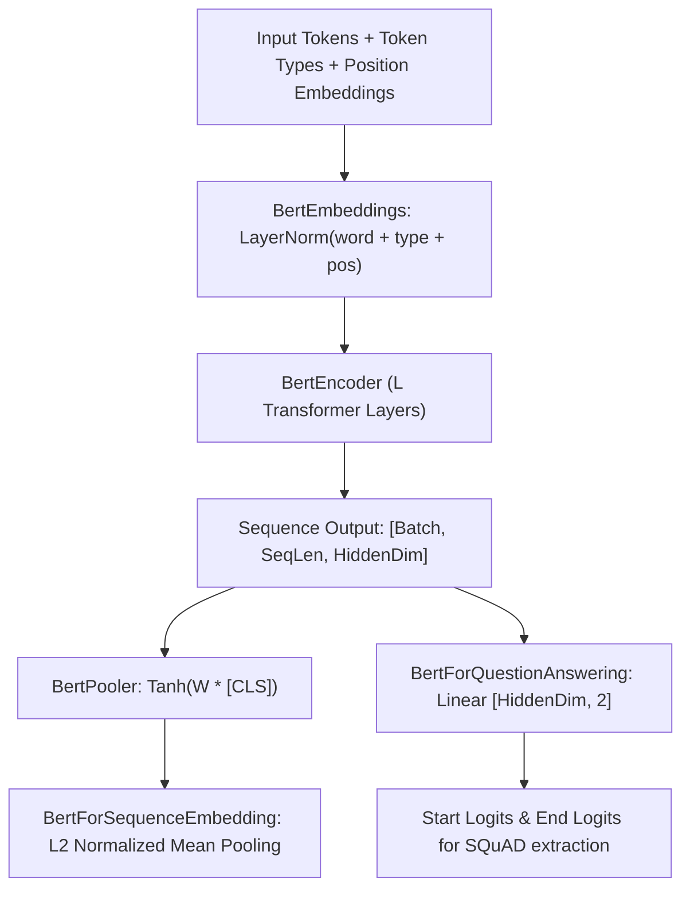

# BERT Architecture (`models::bert`)

Bidirectional Encoder Representations from Transformers (BERT) for extractive Question Answering and dense sequence embeddings.

**Source files**:
- Core implementation: [`src/models/bert.rs`](file:///home/elvin/Development/Repositories/elvin-mark/neural-network-engine/src/models/bert.rs)
- Unit tests: [`tests/bert_tests.rs`](file:///home/elvin/Development/Repositories/elvin-mark/neural-network-engine/tests/bert_tests.rs)
- CLI Binaries: [`src/bin/similarity.rs`](file:///home/elvin/Development/Repositories/elvin-mark/neural-network-engine/src/bin/similarity.rs), [`src/bin/qa.rs`](file:///home/elvin/Development/Repositories/elvin-mark/neural-network-engine/src/bin/qa.rs)

---

## Architectural Variants



---

## The Head Implementations

### 1. `BertForQuestionAnswering`
Applies a single linear projection $[D, 2]$ to the final encoder output:
$$(\text{start\_logits}, \text{end\_logits}) = \text{Linear}(H)$$
For a given question and context token span, the model extracts the sub-slice $(s, e)$ that maximizes $S[s] + E[e]$.

### 2. `BertForSequenceEmbedding`
Used for semantic search and dense sentence similarity (`all-MiniLM-L6-v2`):
1. Runs bidirectional transformer over input tokens.
2. Applies **mean pooling** across non-padding tokens:
   $$v = \frac{1}{\sum m_i} \sum_{i=1}^T H_i$$
3. Normalizes vector to unit length ($\|v\|_2 = 1.0$), allowing cosine similarity to be evaluated via simple dot product.

---

## Presets & Configuration (`BertConfig`)

```rust
pub struct BertConfig {
    pub vocab_size: usize,                  // 30522
    pub hidden_size: usize,                 // 384 (MiniLM) or 768 (base)
    pub num_hidden_layers: usize,           // 6 (MiniLM-L6) or 12 (base)
    pub num_attention_heads: usize,         // 12
    pub intermediate_size: usize,           // 1536 (MiniLM) or 3072 (base)
    pub hidden_act: String,                 // "gelu"
    pub max_position_embeddings: usize,     // 512
    pub type_vocab_size: usize,             // 2 (Sentence A vs Sentence B)
    pub layer_norm_eps: f32,                // 1e-12
}
```

- `BertConfig::all_minilm_l6_v2()`: Standard 6-layer 384-dim dense retrieval model.
- `BertConfig::tinybert()`: Compact 4-layer extractive Question Answering model.

---

## See Also
- [Sentence Similarity CLI (`similarity`)](file:///home/elvin/Development/Repositories/elvin-mark/neural-network-engine/docs/infra/cli.md)
- [Question Answering CLI (`qa`)](file:///home/elvin/Development/Repositories/elvin-mark/neural-network-engine/docs/infra/cli.md)
- [ModernBERT Architecture](file:///home/elvin/Development/Repositories/elvin-mark/neural-network-engine/docs/models/modern-bert.md)
