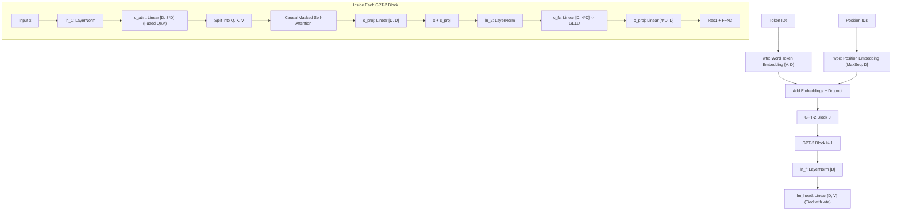

# GPT-2 Architecture (`models::gpt2`)

The classic OpenAI GPT-2 autoregressive decoder transformer architecture.

**Source files**:
- Core implementation: [`src/models/gpt2.rs`](file:///home/elvin/Development/Repositories/elvin-mark/neural-network-engine/src/models/gpt2.rs)
- Unit tests: [`tests/gpt2_tests.rs`](file:///home/elvin/Development/Repositories/elvin-mark/neural-network-engine/tests/gpt2_tests.rs)
- Text Generation CLI: [`src/bin/generate.rs`](file:///home/elvin/Development/Repositories/elvin-mark/neural-network-engine/src/bin/generate.rs)

---

## Architecture Diagram



---

## HuggingFace Weight Compatibility Note: Conv1D Transposition

In OpenAI and HuggingFace checkpoints, GPT-2 linear layers were historically implemented using a custom `Conv1D` module storing weights in transposed layout: $[D_{\text{in}}, D_{\text{out}}]$ instead of PyTorch's standard `nn.Linear` shape $[D_{\text{out}}, D_{\text{in}}]$.

The engine's `GPT2Model::load_safetensors` automatically transposes these weight matrices upon deserialization:
- `c_attn.weight`: `[D, 3*D] -> [3*D, D]`
- `c_proj.weight`: `[D, D] -> [D, D]`
- `c_fc.weight`: `[D, 4*D] -> [4*D, D]`

---

## Presets & Configuration

```rust
pub struct GPT2Config {
    pub vocab_size: usize,        // 50257
    pub n_positions: usize,       // 1024
    pub n_embd: usize,            // 768 (124M), 1024 (medium)
    pub n_layer: usize,           // 12 (124M), 24 (medium)
    pub n_head: usize,            // 12 (124M), 16 (medium)
    pub layer_norm_epsilon: f32,  // 1e-5
}
```

- `GPT2Config::gpt2_124m()`: Base 124M parameter configuration.
- `GPT2Config::gpt2_medium()`: 355M parameter configuration.

---

## See Also
- [Attention & Transformer Primitives](file:///home/elvin/Development/Repositories/elvin-mark/neural-network-engine/docs/nn/attention-and-transformers.md)
- [Text Generation CLI](file:///home/elvin/Development/Repositories/elvin-mark/neural-network-engine/docs/infra/cli.md)
