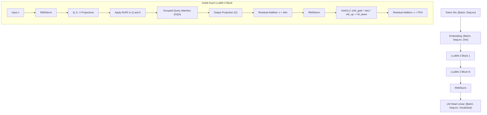

# LLaMA-2 Architecture (`models::llama`)

Pure-Rust implementation of Meta's LLaMA-2 autoregressive transformer architecture with Rotary Position Embeddings (RoPE), SwiGLU feed-forward networks, RMSNorm, and Grouped-Query Attention (GQA).

**Source files**:
- Core implementation: [`src/models/llama.rs`](file:///home/elvin/Development/Repositories/elvin-mark/neural-network-engine/src/models/llama.rs)
- Unit tests: [`tests/llama_tests.rs`](file:///home/elvin/Development/Repositories/elvin-mark/neural-network-engine/tests/llama_tests.rs)
- Example: [`examples/05_llama2_gqa.rs`](file:///home/elvin/Development/Repositories/elvin-mark/neural-network-engine/examples/05_llama2_gqa.rs)

---

## Block Architecture



---

## Configuration (`LlamaConfig`)

```rust
pub struct LlamaConfig {
    pub vocab_size: usize,        // e.g. 32000
    pub hidden_size: usize,       // e.g. 4096 (7B) or 256 (tiny)
    pub intermediate_size: usize, // e.g. 11008 (SwiGLU dimension)
    pub num_hidden_layers: usize, // e.g. 32 (7B) or 4 (tiny)
    pub num_attention_heads: usize,// e.g. 32
    pub num_key_value_heads: usize,// e.g. 8 (GQA) or 32 (MHA)
    pub rms_norm_eps: f32,        // e.g. 1e-5
    pub max_position_embeddings: usize, // e.g. 2048 or 4096
}
```

---

## Key Implementation Details

1. **SwiGLU Feed-Forward Network**:
   $$\text{FFN}_{\text{SwiGLU}}(x) = \left(\text{SiLU}(x W_{\text{gate}}) \odot (x W_{\text{up}})\right) W_{\text{down}}$$
2. **RoPE Frequency Computation**:
   Precomputes cosine and sine frequency matrices up to `max_position_embeddings` to avoid runtime trigonometry overhead during decoding.
3. **KV-Cache Decoding**:
   Compatible with `KVCache`, enabling streaming token-by-token generation with constant per-step latency.

---

## See Also
- [Attention Primitives & GQA](file:///home/elvin/Development/Repositories/elvin-mark/neural-network-engine/docs/nn/attention-and-transformers.md)
- [Text Generation CLI](file:///home/elvin/Development/Repositories/elvin-mark/neural-network-engine/docs/infra/cli.md)
