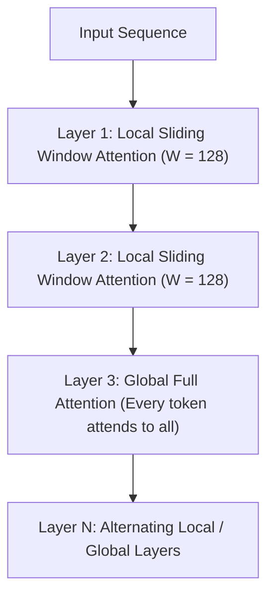

# ModernBERT Architecture (`models::modern_bert`)

Next-generation encoder architecture featuring alternating local sliding-window and global attention, unpadded sequence representations, and GeGLU activations.

**Source files**:
- Core implementation: [`src/models/modern_bert.rs`](file:///home/elvin/Development/Repositories/elvin-mark/neural-network-engine/src/models/modern_bert.rs)
- Unit tests: [`tests/modern_bert_tests.rs`](file:///home/elvin/Development/Repositories/elvin-mark/neural-network-engine/tests/modern_bert_tests.rs)

---

## Key Innovations over Traditional BERT



1. **Alternating Local & Global Attention**:
   - Most layers use **sliding-window local attention** (restricting attention receptive fields to a fixed window $W$, e.g. 128 tokens), reducing attention complexity from $O(T^2)$ to $O(T \cdot W)$.
   - Every $k$-th layer uses **global full attention** to mix representations across the full context length (up to 8,192 tokens).
2. **GeGLU Feed-Forward Networks**:
   $$\text{FFN}_{\text{GeGLU}}(x) = \left(\text{GELU}(x W_{\text{gate}}) \odot (x W_{\text{up}})\right) W_{\text{down}}$$
3. **No Bias Vectors**:
   Eliminates all linear biases throughout attention and MLP layers, accelerating hardware tensor core execution.
4. **Rotary Embeddings (RoPE)**:
   Replaces learned absolute position embeddings with RoPE applied to queries and keys.

---

## Configuration (`ModernBertConfig`)

```rust
pub struct ModernBertConfig {
    pub vocab_size: usize,                  // 50368
    pub hidden_size: usize,                 // 768
    pub intermediate_size: usize,           // 1152 (GeGLU)
    pub num_hidden_layers: usize,           // 22
    pub num_attention_heads: usize,         // 12
    pub max_position_embeddings: usize,     // 8192
    pub local_attention: usize,             // 128 (window size)
    pub global_attn_every_n_layers: usize,  // 3
    pub norm_eps: f32,                      // 1e-5
}
```

---

## See Also
- [BERT Architecture](file:///home/elvin/Development/Repositories/elvin-mark/neural-network-engine/docs/models/bert.md)
- [Sentence Similarity CLI](file:///home/elvin/Development/Repositories/elvin-mark/neural-network-engine/docs/infra/cli.md)
