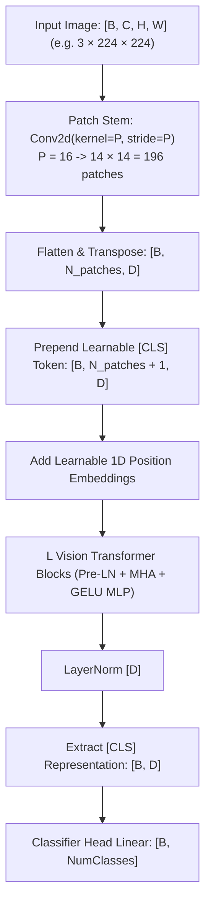

# Vision Transformer Architecture (`models::vit`)

An end-to-end Vision Transformer (ViT) implementing patch projection embeddings, learnable `[CLS]` tokens, and standard transformer encoder blocks for image classification.

**Source files**:
- Core implementation: [`src/models/vit.rs`](file:///home/elvin/Development/Repositories/elvin-mark/neural-network-engine/src/models/vit.rs)
- Example: [`examples/10_cifar100_vit.rs`](file:///home/elvin/Development/Repositories/elvin-mark/neural-network-engine/examples/10_cifar100_vit.rs)

---

## Architectural Flow



---

## Key Formulation

1. **Patch Embedding Stem**:
   Instead of extracting features with deep convolutions, the image is tiled into non-overlapping patches of size $P \times P$ (e.g. $16 \times 16$). A `Conv2d` layer with `kernel_size = (P, P)` and `stride = (P, P)` projects each patch into hidden dimension $D$.
2. **Patch Sequence Length**:
   $$N = \frac{H \times W}{P^2}$$
3. **`[CLS]` Token**:
   A learnable embedding vector is prepended to the sequence of patch tokens. The final representation at index $0$ serves as the global image feature vector passed to the classification head.

---

## Presets & Configuration (`ViTConfig`)

```rust
pub struct ViTConfig {
    pub image_size: usize,        // 224
    pub patch_size: usize,        // 16
    pub num_channels: usize,      // 3
    pub num_classes: usize,       // 1000 or custom
    pub hidden_size: usize,       // 192 (tiny), 384 (small), 768 (base)
    pub num_hidden_layers: usize, // 12
    pub num_attention_heads: usize,// 3 (tiny), 6 (small), 12 (base)
    pub intermediate_size: usize, // 4 * hidden_size
    pub layer_norm_eps: f32,      // 1e-6
}
```

Preset constructor:
```rust
let config = ViTConfig::vit_tiny_patch16_224(num_classes: 1000);
let model = VisionTransformer::new(config);
```

---

## See Also
- [ResNet Convolutional Vision Backbone](file:///home/elvin/Development/Repositories/elvin-mark/neural-network-engine/docs/models/resnet.md)
- [Vision Transforms](file:///home/elvin/Development/Repositories/elvin-mark/neural-network-engine/docs/infra/data-and-vision.md)
