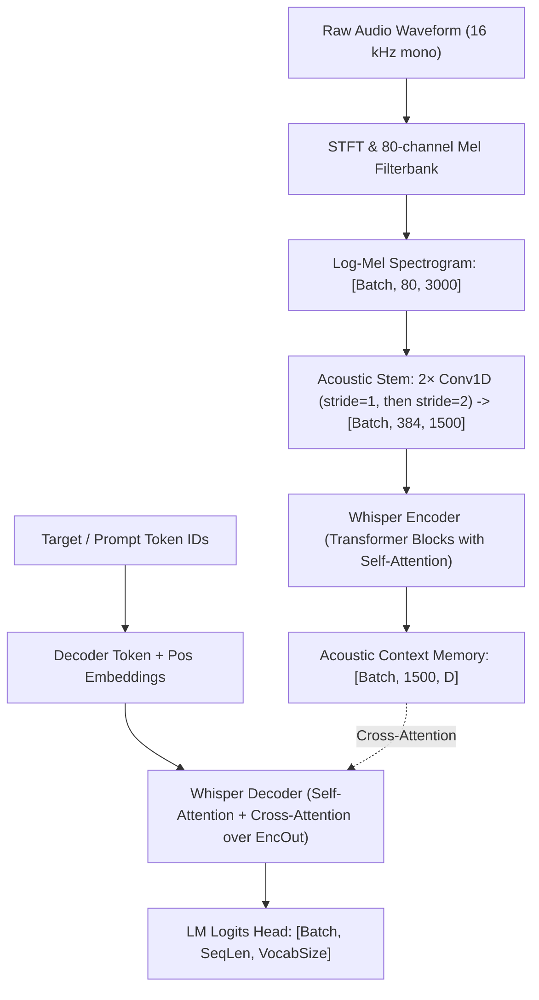

# Whisper Architecture (`models::whisper`)

OpenAI's Whisper sequence-to-sequence encoder-decoder architecture for automatic speech recognition (ASR) and audio processing.

**Source files**:
- Core implementation: [`src/models/whisper.rs`](file:///home/elvin/Development/Repositories/elvin-mark/neural-network-engine/src/models/whisper.rs)
- Audio frontend: [`src/utils/audio.rs`](file:///home/elvin/Development/Repositories/elvin-mark/neural-network-engine/src/utils/audio.rs)
- Unit tests: [`tests/whisper_tests.rs`](file:///home/elvin/Development/Repositories/elvin-mark/neural-network-engine/tests/whisper_tests.rs)
- Example: [`examples/12_whisper_speech_recognition.rs`](file:///home/elvin/Development/Repositories/elvin-mark/neural-network-engine/examples/12_whisper_speech_recognition.rs)

---

## Architectural Flow



---

## Configuration (`WhisperConfig`)

```rust
pub struct WhisperConfig {
    pub num_mel_bins: usize,      // 80
    pub max_source_positions: usize, // 1500
    pub d_model: usize,           // 384 (tiny), 512 (base)
    pub encoder_layers: usize,    // 4 (tiny), 6 (base)
    pub encoder_attention_heads: usize,// 6 (tiny), 8 (base)
    pub decoder_layers: usize,    // 4 (tiny), 6 (base)
    pub decoder_attention_heads: usize,// 6 (tiny), 8 (base)
    pub decoder_ffn_dim: usize,   // 1536 (tiny), 2048 (base)
    pub vocab_size: usize,        // 51865
    pub max_target_positions: usize, // 448
}
```

Preset constructor:
```rust
let config = WhisperConfig::whisper_tiny();
let model = Whisper::new(config);
```

---

## See Also
- [Audio Processing & Mel Filterbank](file:///home/elvin/Development/Repositories/elvin-mark/neural-network-engine/docs/infra/audio.md)
- [Transformer & Attention Primitives](file:///home/elvin/Development/Repositories/elvin-mark/neural-network-engine/docs/nn/attention-and-transformers.md)
