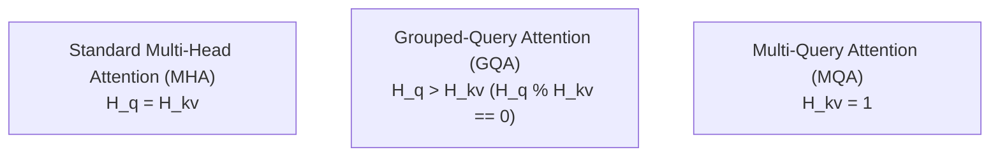
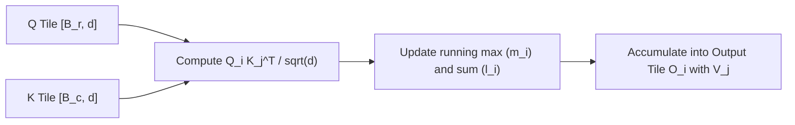

# Attention & Transformer Primitives

Primitives for modern Large Language Models (LLMs) and transformer encoders: Multi-Head Attention, Grouped-Query Attention (GQA), FlashAttention-2 online softmax, Rotary Position Embeddings (RoPE), and Key-Value Caching (`KVCache`).

**Source files**:
- Multi-Head & Grouped Query Attention: [`src/nn/attention.rs`](file:///home/elvin/Development/Repositories/elvin-mark/neural-network-engine/src/nn/attention.rs)
- FlashAttention-2: [`src/nn/flash_attention.rs`](file:///home/elvin/Development/Repositories/elvin-mark/neural-network-engine/src/nn/flash_attention.rs)
- Key-Value Cache: [`src/nn/kv_cache.rs`](file:///home/elvin/Development/Repositories/elvin-mark/neural-network-engine/src/nn/kv_cache.rs)
- Transformer & LLaMA Blocks: [`src/nn/transformer.rs`](file:///home/elvin/Development/Repositories/elvin-mark/neural-network-engine/src/nn/transformer.rs)

---

## Attention Mechanisms Comparison



### 1. Multi-Head Attention (`MultiHeadAttention`)
Computes scaled dot-product attention across $H$ parallel heads:
$$\text{Attention}(Q, K, V) = \text{Softmax}\left(\frac{Q K^T}{\sqrt{d_k}} + M\right) V$$
where $M$ is an optional additive causal attention mask setting future tokens to $-\infty$.

### 2. Grouped-Query Attention (`GroupedQueryAttention`)
Used in LLaMA-2 70B and modern open models: shares $H_{\text{kv}}$ key-value heads across $H_q$ query heads ($H_q = G \times H_{\text{kv}}$), reducing KV memory traffic by factor $G$ during autoregressive generation.

---

## Rotary Position Embeddings (RoPE)

Rather than adding absolute position vectors to embeddings, RoPE rotates 2D pairs of query and key coordinates in the complex plane:

$$R_{\Theta, m}^d = \text{diag}\left(R_{\theta_1, m}, R_{\theta_2, m}, \dots, R_{\theta_{d/2}, m}\right)$$
where:
$$\theta_i = 10000^{-2(i-1)/d}$$
$$R_{\theta_i, m} = \begin{pmatrix} \cos(m \theta_i) & -\sin(m \theta_i) \\ \sin(m \theta_i) & \cos(m \theta_i) \end{pmatrix}$$

This enables the inner product $\langle R_m q, R_n k \rangle$ to encode relative distance $(m - n)$ naturally.

```rust
let rope = RotaryEmbedding::new(dim: 64, max_seq_len: 4096);
let q_rot = rope.forward(&q, start_pos)?;
let k_rot = rope.forward(&k, start_pos)?;
```

---

## FlashAttention-2 (Online Tiled Softmax)

Standard attention materializes an intermediate $O(T^2)$ attention weight matrix. **FlashAttention-2** tiles the $Q, K, V$ matrices into SRAM blocks (size $B_r \times B_c$) and computes attention incrementally via online softmax without writing $S$ or $P$ to main memory:



### Memory Complexity
- **Standard Attention**: $O(T^2)$ memory allocations.
- **FlashAttention-2**: $O(T)$ memory footprint, allowing evaluation of long sequences without OOM.

```rust
pub fn flash_attention_forward(
    q: &Tensor,
    k: &Tensor,
    v: &Tensor,
    causal: bool,
    softmax_scale: Option<f32>,
) -> Result<Tensor>
```

---

## Key-Value Cache (`KVCache`)

During autoregressive generation, evaluating the entire prompt history at every step yields $O(T^2)$ complexity. The `KVCache` stores previous key and value states in pre-allocated buffers:

```rust
pub struct KVCache {
    k_cache: Vec<Tensor>, // Per-layer K buffers
    v_cache: Vec<Tensor>, // Per-layer V buffers
    current_len: usize,
    max_len: usize,
}
```

- In step $t$, only the **single newly generated token** ($T_{\text{new}} = 1$) is projected into $q_t, k_t, v_t$.
- $k_t$ and $v_t$ are appended to the cache in $O(1)$ time.
- Attention is computed between $q_t \in [1, d]$ and $K_{\le t}, V_{\le t} \in [t, d]$, reducing per-step generation complexity from $O(t^2)$ to $O(t)$.

---

## Transformer Block Architectures

The engine implements both classic Post-Norm / Pre-Norm Transformer blocks and modern LLaMA-style blocks:

| Component | Standard Transformer (`TransformerBlock`) | Modern LLaMA Block (`Llama2Block`) |
|---|---|---|
| **Normalization** | `LayerNorm` (Pre-LN) | `RMSNorm` |
| **Attention** | `MultiHeadAttention` | `GroupedQueryAttention` + RoPE |
| **Feed-Forward (FFN)** | Linear $\to$ GELU $\to$ Linear | `SwiGLU` (Gate $\odot$ Up $\to$ Down) |
| **Residual Connections** | $x + \text{Attn}(\text{LN}(x))$ | $x + \text{Attn}(\text{RMS}(x))$ |

---

## See Also
- [Mixture-of-Experts & INT8 Quantization](file:///home/elvin/Development/Repositories/elvin-mark/neural-network-engine/docs/nn/moe-and-quantization.md)
- [LLaMA-2 Model Architecture](file:///home/elvin/Development/Repositories/elvin-mark/neural-network-engine/docs/models/llama.md)
- [Text Generation CLI](file:///home/elvin/Development/Repositories/elvin-mark/neural-network-engine/docs/infra/cli.md)
