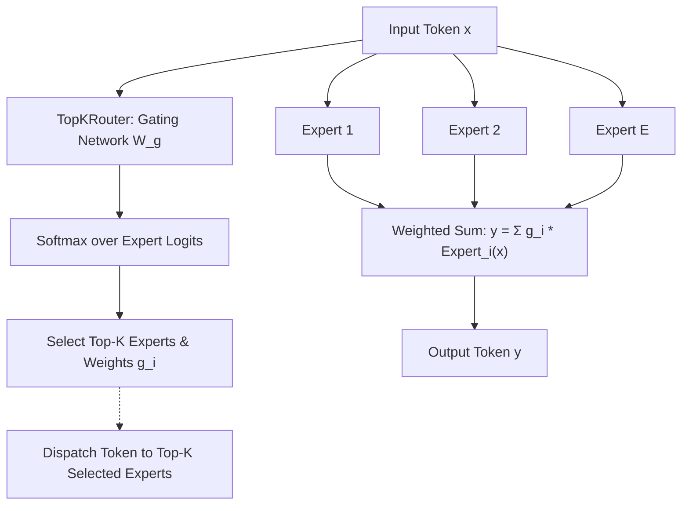

# Mixture-of-Experts & INT8 Quantization

Architectural extensions for sparse scaling (MoE) and inference compression (INT8 quantized linear layers).

**Source files**:
- Mixture-of-Experts: [`src/nn/moe.rs`](file:///home/elvin/Development/Repositories/elvin-mark/neural-network-engine/src/nn/moe.rs)
- INT8 Quantization: [`src/nn/quantized.rs`](file:///home/elvin/Development/Repositories/elvin-mark/neural-network-engine/src/nn/quantized.rs)
- Unit tests: [`tests/moe_tests.rs`](file:///home/elvin/Development/Repositories/elvin-mark/neural-network-engine/tests/moe_tests.rs), [`tests/quantization_tests.rs`](file:///home/elvin/Development/Repositories/elvin-mark/neural-network-engine/tests/quantization_tests.rs)

---

## Sparse Mixture-of-Experts (MoE)

Sparse Mixture-of-Experts replaces standard dense feed-forward networks (FFNs) with multiple parallel "expert" networks, routing each token to a subset of top-$K$ experts:



### 1. `TopKRouter`
Computes routing probability across $E$ experts:
$$H(x) = x \cdot W_g$$
$$\text{Gate}(x) = \text{Softmax}(\text{TopK}(H(x), k))$$

```rust
pub struct TopKRouter {
    gate: Linear,
    top_k: usize,
    num_experts: usize,
}
```

### 2. `MoELayer` / `SparseMoEBlock`
Manages an ensemble of expert modules (each typically a 2-layer MLP or SwiGLU block). Tokens are partitioned according to their top-$k$ assignments, passed through the active expert networks, and their outputs are combined using the gating weights.

---

## INT8 Quantization (`Int8Tensor`, `QLinear`)

Quantization compresses 32-bit floating-point weights into 8-bit signed integers (`i8`), achieving a **4x reduction in memory footprint** with minimal loss in model perplexity.

### Symmetric Uniform Quantization
Values in floating-point range $[-M, M]$ are mapped onto 8-bit integer range $[-127, 127]$:

$$\text{scale} = \frac{\max(|W|)}{127}$$
$$W_{\text{int8}} = \text{round}\left(\frac{W_{\text{f32}}}{\text{scale}}\right)$$
$$\hat{W}_{\text{f32}} = W_{\text{int8}} \times \text{scale}$$

```rust
pub struct Int8Tensor {
    data: Vec<i8>,
    shape: Vec<usize>,
    scale: f32, // Per-tensor scale factor
}
```

### Quantized Linear Layer (`QLinear`)
Executes forward inference using integer weights:
$$Y = X \cdot (W_{\text{int8}}^T \cdot \text{scale}) + B$$

- **AVX2 Acceleration**: On supported x86_64 architectures, inner products between quantized weights and activations execute via fused AVX2 SIMD instructions.
- **Pure-Rust Fallback**: Portable scalar fallback for non-x86 platforms.

```rust
let q_layer = QLinear::from_linear(&dense_linear)?;
let y = q_layer.forward(&x)?;
```

---

## See Also
- [Attention & Transformer Primitives](file:///home/elvin/Development/Repositories/elvin-mark/neural-network-engine/docs/nn/attention-and-transformers.md)
- [Linear Layers](file:///home/elvin/Development/Repositories/elvin-mark/neural-network-engine/docs/nn/modules.md)
- [Model Checkpointing](file:///home/elvin/Development/Repositories/elvin-mark/neural-network-engine/docs/infra/serialization.md)
