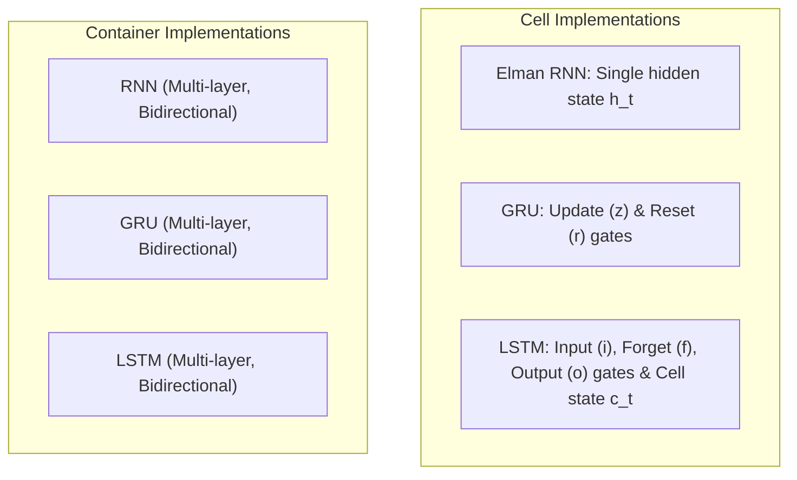

# Recurrent Layers (`nn::rnn`)

Stateful recurrent sequence processing models: Elman RNN, Long Short-Term Memory (LSTM), and Gated Recurrent Unit (GRU).

**Source files**:
- Core implementation: [`src/nn/rnn.rs`](file:///home/elvin/Development/Repositories/elvin-mark/neural-network-engine/src/nn/rnn.rs)
- Unit tests: [`tests/recurrent_tests.rs`](file:///home/elvin/Development/Repositories/elvin-mark/neural-network-engine/tests/recurrent_tests.rs)
- Example: [`examples/15_recurrent_sequence_models.rs`](file:///home/elvin/Development/Repositories/elvin-mark/neural-network-engine/examples/15_recurrent_sequence_models.rs)

---

## Architectural Comparison



---

## Mathematical Formulations

### 1. Elman RNN (`RNNCell` & `RNN`)
Updates hidden state $h_t$ via:
$$h_t = \tanh(W_{ih} x_t + b_{ih} + W_{hh} h_{t-1} + b_{hh})$$

### 2. LSTM (`LSTMCell` & `LSTM`)
Maintains an internal cell state $c_t$ and hidden state $h_t$ via four affine gating mechanisms:
$$i_t = \sigma(W_{ii} x_t + b_{ii} + W_{hi} h_{t-1} + b_{hi}) \quad \text{(Input Gate)}$$
$$f_t = \sigma(W_{if} x_t + b_{if} + W_{hf} h_{t-1} + b_{hf}) \quad \text{(Forget Gate)}$$
$$g_t = \tanh(W_{ig} x_t + b_{ig} + W_{hg} h_{t-1} + b_{hg}) \quad \text{(Cell Candidate)}$$
$$o_t = \sigma(W_{io} x_t + b_{io} + W_{ho} h_{t-1} + b_{ho}) \quad \text{(Output Gate)}$$
$$c_t = f_t \odot c_{t-1} + i_t \odot g_t$$
$$h_t = o_t \odot \tanh(c_t)$$

### 3. GRU (`GRUCell` & `GRU`)
Fuses forget and input gates into an update gate $z_t$, and introduces reset gate $r_t$:
$$r_t = \sigma(W_{ir} x_t + b_{ir} + W_{hr} h_{t-1} + b_{hr}) \quad \text{(Reset Gate)}$$
$$z_t = \sigma(W_{iz} x_t + b_{iz} + W_{hz} h_{t-1} + b_{hz}) \quad \text{(Update Gate)}$$
$$n_t = \tanh(W_{in} x_t + b_{in} + r_t \odot (W_{hn} h_{t-1} + b_{hn})) \quad \text{(New Gate)}$$
$$h_t = (1 - z_t) \odot n_t + z_t \odot h_{t-1}$$

---

## High-Level Sequence Containers

The sequence containers (`RNN`, `LSTM`, `GRU`) support:
- **`num_layers`**: Stacks multiple recurrent stages.
- **`bidirectional`**: Runs independent forward and backward recurrence passes and concatenates hidden representations along the feature axis.
- **`batch_first`**: Controls tensor layout ($[B, T, D]$ when `true` vs $[T, B, D]$ when `false`).

```rust
let lstm = LSTM::new(
    input_size: 64,
    hidden_size: 128,
    num_layers: 2,
    bias: true,
    batch_first: true,
    bidirectional: true,
);

let (output, (h_n, c_n)) = lstm.forward_seq(&x, None)?;
```

- **Output Shape**: `[Batch, SeqLen, num_directions * hidden_size]`
- **Hidden State Shape**: `[num_layers * num_directions, Batch, hidden_size]`

---

## See Also
- [Neural Network Modules](file:///home/elvin/Development/Repositories/elvin-mark/neural-network-engine/docs/nn/modules.md)
- [Weight Initializations](file:///home/elvin/Development/Repositories/elvin-mark/neural-network-engine/docs/nn/initialization.md)
- [Attention & Transformers](file:///home/elvin/Development/Repositories/elvin-mark/neural-network-engine/docs/nn/attention-and-transformers.md)
