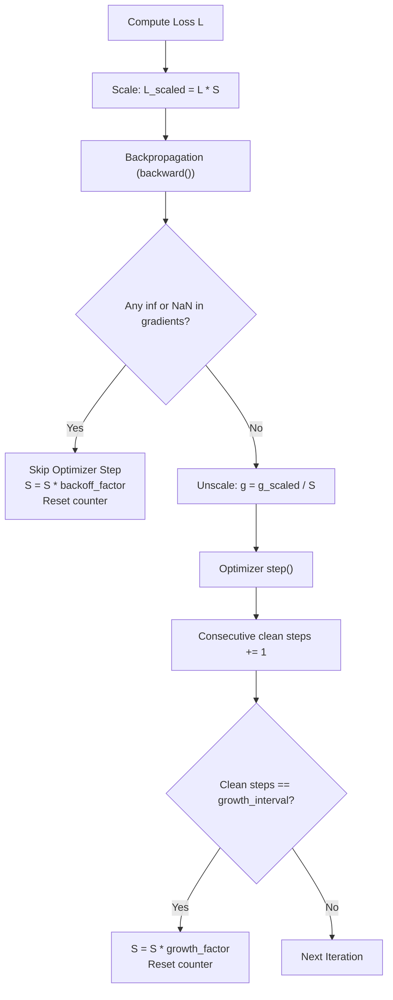

# Automatic Mixed Precision (`amp::LossScaler`)

Dynamic loss scaling to avoid floating-point underflow when training under reduced precision.

**Source files**:
- Core implementation: [`src/optim/amp.rs`](file:///home/elvin/Development/Repositories/elvin-mark/neural-network-engine/src/optim/amp.rs)
- Unit tests: [`tests/amp_tests.rs`](file:///home/elvin/Development/Repositories/elvin-mark/neural-network-engine/tests/amp_tests.rs)
- Example: [`examples/19_moe_and_mixed_precision.rs`](file:///home/elvin/Development/Repositories/elvin-mark/neural-network-engine/examples/19_moe_and_mixed_precision.rs)

---

## Dynamic Loss Scaling (`LossScaler`)

When gradients are computed in lower-precision representations (e.g. FP16/BF16), small gradient values underflow to zero. **Loss scaling** multiplies the forward loss by a scale factor $S$ before backpropagation, shifting small gradients into the representable floating-point range:

$$\mathcal{L}_{\text{scaled}} = \mathcal{L} \times S$$
$$\frac{\partial \mathcal{L}_{\text{scaled}}}{\partial \theta} = S \times \frac{\partial \mathcal{L}}{\partial \theta}$$

Before the optimizer updates parameters, gradients are unscaled by $\frac{1}{S}$:
$$g_{\text{true}} = \frac{1}{S} \times g_{\text{scaled}}$$



---

## The Dynamic Adjustment Algorithm

```rust
pub struct LossScaler {
    scale: f32,
    growth_factor: f32,     // default: 2.0
    backoff_factor: f32,    // default: 0.5
    growth_interval: usize, // default: 2000 clean steps
    consecutive_clean_steps: usize,
}
```

1. **Inf / NaN Detection**: If any gradient contains `inf` or `NaN`:
   - The parameter update is skipped.
   - The scale is multiplied by `backoff_factor` (e.g. cut in half: $S \leftarrow S \times 0.5$).
   - The clean step counter is reset to 0.
2. **Dynamic Scale Expansion**: If `growth_interval` consecutive iterations complete without overflow:
   - The scale is safely multiplied by `growth_factor`: $S \leftarrow S \times 2.0$.

---

## Usage in Training Loops

```rust
let mut scaler = LossScaler::new(65536.0); // Initial scale 2^16

for (x, y) in dataloader.iter() {
    optimizer.zero_grad();

    let output = model.forward(&x)?;
    let loss = criterion.forward(&output, &y)?;

    // 1. Scale loss and run backward pass
    let scaled_loss = scaler.scale_loss(&loss)?;
    scaled_loss.backward()?;

    // 2. Unscale gradients and check for numerical overflow
    let params = model.parameters();
    let has_overflow = scaler.unscale_and_check(&params)?;

    // 3. Step optimizer only if gradients are clean
    if !has_overflow {
        clip_grad_norm(&params, 1.0)?;
        optimizer.step()?;
    }

    // 4. Update dynamic loss scale factor
    scaler.update(has_overflow);
}
```

---

## See Also
- [Optimizers](file:///home/elvin/Development/Repositories/elvin-mark/neural-network-engine/docs/training/optimizers.md)
- [Schedulers & Gradient Clipping](file:///home/elvin/Development/Repositories/elvin-mark/neural-network-engine/docs/training/schedulers-and-clipping.md)
- [INT8 Quantization](file:///home/elvin/Development/Repositories/elvin-mark/neural-network-engine/docs/nn/moe-and-quantization.md)
